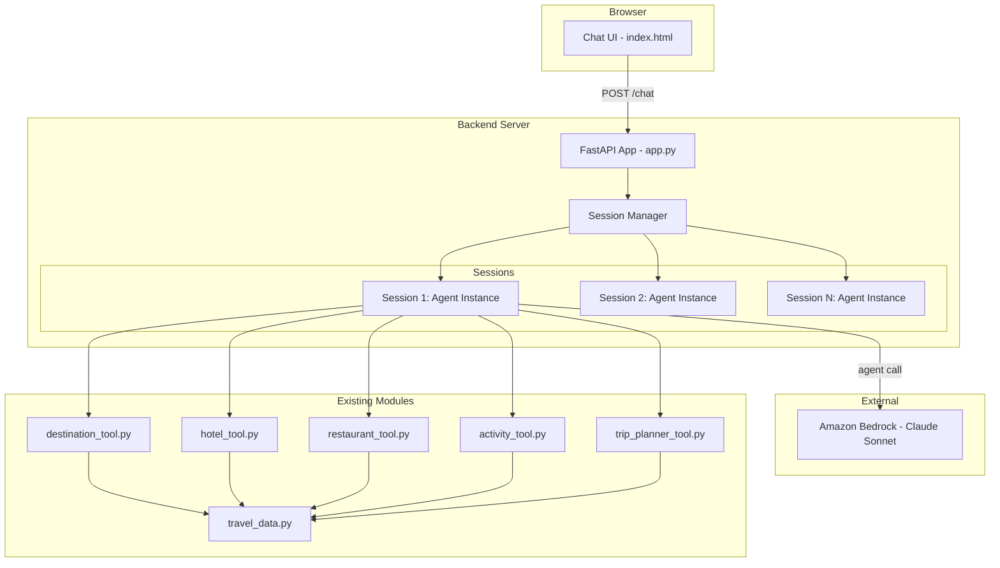

# Design Document

## Overview

This document describes the architecture and design of the Egypt Travel Frontend — a web-based chat interface backed by a REST API that wraps the existing Strands Agent. The system consists of two components: a FastAPI backend that manages agent sessions and forwards messages to the Strands Agent, and a vanilla HTML/CSS/JS single-page application that provides a chat UI in the browser.

The backend maintains one Strands Agent instance per session in memory, preserving conversation history across requests. The frontend communicates with the backend via a single POST endpoint, displaying messages in a familiar chat layout with optimistic updates and error handling.

**Key design decisions:**
- **FastAPI** over Flask: native async support for handling agent calls without blocking, built-in request validation via Pydantic, automatic OpenAPI docs, and simpler CORS middleware setup.
- **Vanilla HTML/CSS/JS** over a framework: the scope is a single chat page with no routing, state management, or component reuse needs. A framework would add build tooling overhead without proportional benefit.
- **In-memory session store** with TTL: simplest approach for a single-server development deployment. Sessions are Python dicts mapping session IDs to Agent instances with last-access timestamps.

## Architecture



**Request flow:**
1. User types a message in the browser and clicks Send
2. Frontend sends `POST /chat` with `{ "message": "...", "session_id": "..." }`
3. Backend validates the request, looks up or creates a session
4. Backend calls `agent(message)` on the session's Agent instance
5. Agent invokes tools as needed, calls Bedrock, returns response text
6. Backend returns `{ "response": "...", "session_id": "..." }`
7. Frontend displays the agent's response in the chat window

## Components and Interfaces

### 1. Backend API (`app.py`)

A FastAPI application with a single endpoint and session management.

```python
from fastapi import FastAPI
from fastapi.middleware.cors import CORSMiddleware
from pydantic import BaseModel, Field
import uuid
import time
import asyncio

app = FastAPI(title="Egypt Travel Agent API")

# CORS for development
app.add_middleware(
    CORSMiddleware,
    allow_origins=["*"],
    allow_methods=["*"],
    allow_headers=["*"],
)

class ChatRequest(BaseModel):
    message: str = Field(..., min_length=1, max_length=2000)
    session_id: str | None = None

class ChatResponse(BaseModel):
    response: str
    session_id: str
    new_session: bool = False

class ErrorResponse(BaseModel):
    error: str

@app.post("/chat", response_model=ChatResponse)
async def chat(request: ChatRequest) -> ChatResponse:
    """Process a chat message and return the agent's response."""
    ...
```

### 2. Session Manager (`session_manager.py`)

Manages in-memory sessions with TTL-based expiration.

```python
import uuid
import time
from strands import Agent
from strands.models.bedrock import BedrockModel

SESSION_TTL_SECONDS = 30 * 60  # 30 minutes

class SessionStore:
    """In-memory session store with TTL expiration."""

    def __init__(self):
        self._sessions: dict[str, dict] = {}
        # Each entry: {"agent": Agent, "last_access": float}

    def create_session(self) -> str:
        """Create a new session with a fresh Agent instance."""
        session_id = str(uuid.uuid4())
        agent = self._create_agent()
        self._sessions[session_id] = {
            "agent": agent,
            "last_access": time.time(),
        }
        return session_id

    def get_session(self, session_id: str) -> Agent | None:
        """Get agent for session, or None if expired/invalid."""
        entry = self._sessions.get(session_id)
        if entry is None:
            return None
        if time.time() - entry["last_access"] > SESSION_TTL_SECONDS:
            del self._sessions[session_id]
            return None
        entry["last_access"] = time.time()
        return entry["agent"]

    def cleanup_expired(self):
        """Remove all expired sessions."""
        now = time.time()
        expired = [
            sid for sid, entry in self._sessions.items()
            if now - entry["last_access"] > SESSION_TTL_SECONDS
        ]
        for sid in expired:
            del self._sessions[sid]

    def _create_agent(self) -> Agent:
        """Create a new Agent with the same config as the notebook."""
        from destination_tool import get_destinations, get_destination_details
        from hotel_tool import get_hotels
        from restaurant_tool import get_restaurants
        from activity_tool import get_activities
        from trip_planner_tool import plan_trip

        model = BedrockModel(
            model_id="anthropic.claude-sonnet-4-6",
            region_name="us-west-2",
        )
        return Agent(
            model=model,
            tools=[get_destinations, get_destination_details, get_hotels,
                   get_restaurants, get_activities, plan_trip],
            system_prompt=EGYPT_TRAVEL_SYSTEM_PROMPT,
        )
```

### 3. Frontend (`static/index.html`)

A single HTML file containing embedded CSS and JavaScript. No build step required.

```
static/
└── index.html    # Complete SPA: HTML structure, CSS styles, JS logic
```

**HTML structure:**
```html
<div class="chat-container">
    <div class="chat-header">Egypt Travel Agent</div>
    <div class="chat-window" id="chatWindow">
        <!-- Messages rendered here -->
    </div>
    <div class="input-area">
        <input type="text" id="messageInput" maxlength="500" placeholder="Ask about Egypt travel...">
        <span class="char-count" id="charCount">0/2000</span>
        <button id="sendButton" disabled>Send</button>
    </div>
</div>
```

**JavaScript responsibilities:**
- Manage session ID in `localStorage`
- Send messages via `fetch` to `POST /chat`
- Render messages with timestamps and role-based styling
- Handle loading state, errors, and input validation
- Auto-scroll on new messages

### 4. Static File Serving

FastAPI serves the static frontend files directly during development:

```python
from fastapi.staticfiles import StaticFiles
from fastapi.responses import FileResponse

app.mount("/static", StaticFiles(directory="static"), name="static")

@app.get("/")
async def root():
    return FileResponse("static/index.html")
```

## Data Models

### Chat Request (Frontend → Backend)

```json
{
    "message": "string (1-2000 chars, required)",
    "session_id": "string (UUID, optional)"
}
```

### Chat Response (Backend → Frontend)

```json
{
    "response": "string (agent's reply)",
    "session_id": "string (UUID)",
    "new_session": "boolean (true if a new session was created)"
}
```

### Error Response (Backend → Frontend)

```json
{
    "error": "string (description of what went wrong)"
}
```

HTTP status codes:
- `200` — successful response
- `400` — invalid request (missing/empty message, malformed JSON)
- `500` — agent processing error
- `504` — agent timeout (60 seconds)

### Frontend Message Object (internal JS)

```javascript
{
    role: "user" | "agent" | "error" | "welcome",
    text: "string",
    timestamp: "ISO 8601 string"
}
```

### Session Entry (internal Python)

```python
{
    "agent": Agent,          # Strands Agent instance with conversation history
    "last_access": float,    # Unix timestamp of last request
}
```

## Correctness Properties

*A property is a characteristic or behavior that should hold true across all valid executions of a system — essentially, a formal statement about what the system should do. Properties serve as the bridge between human-readable specifications and machine-verifiable correctness guarantees.*

### Property 1: Valid request produces structured response

*For any* valid message string (1–2000 non-whitespace-only characters), sending it to the POST /chat endpoint shall return an HTTP 200 response containing a JSON object with a non-empty "response" string field and a valid "session_id" string field.

**Validates: Requirements 1.1**

### Property 2: Invalid input produces 400 error

*For any* request payload that is missing the "message" field, contains an empty "message" field, or contains a "message" field composed entirely of whitespace, the POST /chat endpoint shall return an HTTP 400 response with a JSON object containing an "error" string field.

**Validates: Requirements 1.6**

### Property 3: Agent errors produce 500 response

*For any* exception raised by the Agent during message processing, the POST /chat endpoint shall return an HTTP 500 response with a JSON object containing an "error" string field, and shall never expose the raw exception traceback to the client.

**Validates: Requirements 1.5**

### Property 4: Session creation for missing or invalid identifiers

*For any* request that either omits the session_id field or provides a session_id that does not correspond to an active session, the backend shall create a new session, return a unique UUID session_id in the response, and set the "new_session" field to true.

**Validates: Requirements 2.3, 2.5**

### Property 5: Session ID consistency

*For any* request that includes a valid, non-expired session_id, the response shall contain the same session_id value that was sent in the request.

**Validates: Requirements 2.4**

### Property 6: Session isolation

*For any* two distinct sessions, messages sent to one session shall not affect the conversation history or responses of the other session.

**Validates: Requirements 2.1, 2.2**

### Property 7: Message timestamps always present

*For any* message rendered in the chat window (user, agent, or error), the message element shall contain a visible timestamp string.

**Validates: Requirements 3.7**

### Property 8: Whitespace-only input prevents submission

*For any* string composed entirely of whitespace characters (spaces, tabs, newlines), the send button shall be disabled and form submission shall be prevented.

**Validates: Requirements 4.7**

### Property 9: Character limit enforcement

*For any* message text exceeding 2000 characters, the frontend shall prevent submission and display a character limit indicator showing the current count exceeds the maximum.

**Validates: Requirements 4.8**

### Property 10: Optimistic message display

*For any* message submitted by the user, the message text shall appear in the chat window as a user-role message before the backend response is received.

**Validates: Requirements 4.2**

### Property 11: Input cleared after send

*For any* message successfully submitted, the Message_Input text field shall be empty immediately after submission.

**Validates: Requirements 4.3**

### Property 12: Error recovery restores interactive state

*For any* error condition (API error, network error, or timeout), after the error is displayed, the Loading_Indicator shall be removed, the Message_Input and send button shall be re-enabled, and the user's most recent message shall remain visible in the chat window.

**Validates: Requirements 5.1, 5.3**

## Error Handling

### Backend Error Handling

| Scenario | HTTP Status | Response | Behavior |
|----------|-------------|----------|----------|
| Missing or empty message | 400 | `{"error": "Message field is required and must be non-empty"}` | FastAPI/Pydantic validation |
| Message exceeds 2000 chars | 400 | `{"error": "Message must not exceed 2000 characters"}` | Pydantic Field validation |
| Invalid JSON body | 422 | `{"error": "Invalid request format"}` | FastAPI default handler |
| Agent raises exception | 500 | `{"error": "The travel agent encountered an error. Please try again."}` | try/except around agent call |
| Agent timeout (>60s) | 504 | `{"error": "Request timed out. Please try a simpler question."}` | asyncio.wait_for with 60s timeout |
| Invalid/expired session_id | 200 | Normal response with `new_session: true` | Graceful fallback to new session |

### Frontend Error Handling

| Scenario | User-Facing Behavior |
|----------|---------------------|
| API returns 4xx/5xx | Display error message (red background) in chat window |
| Network unreachable | Display "Unable to connect to the server. Check your connection." |
| Request exceeds 30s | Abort fetch, display "Request timed out. Please try again." |
| Any error | Remove loading indicator, re-enable input, preserve user message |

### Backend Timeout Implementation

```python
async def chat(request: ChatRequest):
    agent = session_store.get_session(request.session_id)
    try:
        # Run agent in thread pool with timeout
        response = await asyncio.wait_for(
            asyncio.to_thread(agent, request.message),
            timeout=60.0
        )
    except asyncio.TimeoutError:
        return JSONResponse(status_code=504, content={"error": "Request timed out"})
    except Exception:
        return JSONResponse(status_code=500, content={"error": "Agent error"})
```

### Frontend Timeout Implementation

```javascript
const controller = new AbortController();
const timeoutId = setTimeout(() => controller.abort(), 30000);

try {
    const response = await fetch('/chat', {
        method: 'POST',
        headers: { 'Content-Type': 'application/json' },
        body: JSON.stringify({ message, session_id: sessionId }),
        signal: controller.signal,
    });
    clearTimeout(timeoutId);
    // handle response...
} catch (error) {
    clearTimeout(timeoutId);
    if (error.name === 'AbortError') {
        displayError('Request timed out. Please try again.');
    } else {
        displayError('Unable to connect to the server.');
    }
}
```

## Testing Strategy

### Unit Tests (Backend)

Using `unittest` (per project convention):
- Test request validation: missing message, empty message, whitespace message, oversized message
- Test session creation: new session returns valid UUID
- Test session lookup: valid ID returns agent, invalid ID returns None
- Test session expiration: sessions older than 30 minutes are removed
- Test error response formatting: agent exceptions produce correct 500 structure
- Test CORS headers are present

### Unit Tests (Frontend)

Using inline test functions or manual browser testing:
- Input validation: send button disabled for empty/whitespace input
- Character count display updates on input
- Message rendering: user messages right-aligned, agent messages left-aligned
- Timestamp formatting
- Welcome message display logic (with/without stored session)

### Property Tests

Using `hypothesis` (Python property-based testing library):
- **Property 1**: For random valid strings (1-2000 chars), mock agent returns string → response has correct structure
- **Property 2**: For random invalid payloads, endpoint returns 400
- **Property 3**: For random exceptions, endpoint returns 500 with error field
- **Property 4**: For random invalid UUIDs, endpoint creates new session
- **Property 5**: For random valid session IDs, response echoes the same ID
- **Property 6**: For random message pairs to different sessions, histories remain independent
- **Property 8**: For random whitespace strings, validation rejects them

Each property test runs minimum 100 iterations. Each test is tagged:
```python
# Feature: egypt-travel-frontend, Property 1: Valid request produces structured response
```

### Integration Tests

- Multi-turn conversation: send 3+ messages to same session, verify agent shows context awareness
- Full request cycle: frontend → backend → agent → backend → frontend
- Session persistence: create session, send messages, verify session_id stays consistent
- Timeout behavior: mock slow agent, verify 504 response

### Manual Testing

- Responsive layout at various viewport widths
- Visual distinction between message types
- Auto-scroll behavior
- Welcome message appearance and persistence
